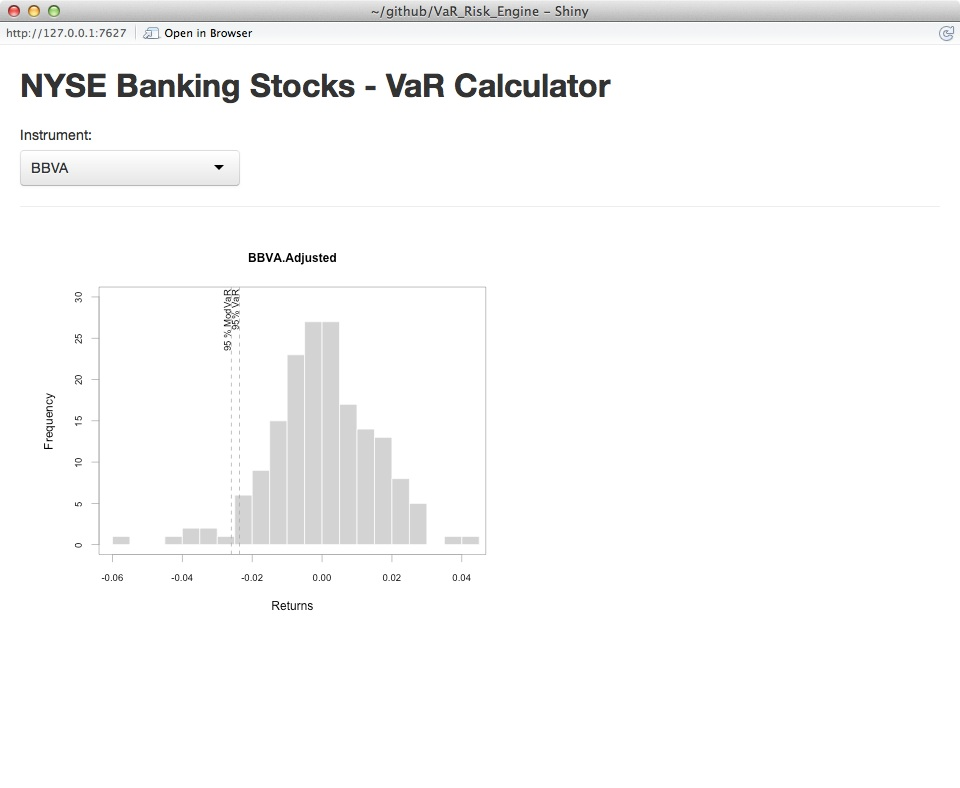

**Introduction**

My recent article focused on using R to perform some basic exploratory data analysis.[^1]   

The focus of this article will be to highlight some packages that focus on financial analytics (TTR, quantmod and PerformanceAnalytics) and a package that will allow us to build an interactive UI with a package called Shiny.

For this article we will focus on Value at Risk[^2], a common market risk measure developed by JP Morgan and most recently criticized by Nassim Taleb [^3].

**Simple Historical Simulation Methodology**

For the first part of this article I will walk through the methodology of calculating VaR for a single-stock using the historical simulation method (as opposed to the Monte Carlo or parametric method) [^4]. 

VaR allows a risk manager to make a statement about a maximum loss over a specified horizon at a certain confidence level.

V will be the Value at Risk for a one day horizon at a 95% confidence level.  

Briefly, this method is:  retrieve and sort a returns timeseries from a specified period (usually 500 days) and take a specific quantile and you will have the Value at Risk for that position.   

Note however this will only apply to a single stock – adding stocks to a portfolio will require correlation effects to be accounted for, and this will substantially increase compute requirements, a topic for later.  Normally a portfolio will not only include multiple stocks, but forwards, futures and other derivative positions.

In R, we would proceed as follows.

```{r, warning=FALSE, error=FALSE, message=FALSE}

  ##pre-requisite packages
  
  library(quantmod)
  library(PerformanceAnalytics)
```

With the packages loaded we can now run through the algorithm:

```{r, warning=FALSE, error=FALSE, message=FALSE}

  X <- c(0.05)
  stock <- c("AA") ##American Airlines


  ## define the historical timeseries
  begin <- Sys.Date() - 501 
  end <- Sys.Date()   

  ## first use of quantmod to get the ticker and populate our dataset with the timeseries of Adjusted closing price
  tickers <- getSymbols(stock, from = begin, to = end, auto.assign = TRUE)  
  dataset <- Ad(get(tickers[1]))  

  ## now we need to convert the closing prices into a daily returns timeseries - we will use the Performance Analytics package
  returns_AA <- Return.calculate(dataset, method=c("simple"))
```

We now have the dataset and can start to do some elementary plotting, firstly the returns timeseries to have a quick look:

```{r}

  chartSeries(returns_AA)

```

Now, we'll convert the timeseries into a sorted list and apply the quantile function
```{r}

  ##convert to matrix datatype as zoo datatypes can't be sorted, then sort ascending
  returns_AA.m <- as.matrix(returns_AA); sorted <- returns_AA.m[order(returns_AA.m[,1])]   

  ##calculate the 5th percentile, na.rm=TRUE tells the function to ignore NA values (not available values)
  100*round(quantile(returns_AA.m[order(returns_AA.m[,1])], c(.05), na.rm=TRUE), 4)   
  
```

This shows us that the 5% one day value at risk for a position in American Airlines is -2.14%, that is, for $100 of position, once every 20 days you would lose *more than* $2.14.

**Building a UI**

A worthwhile read to using Shiny is available on the Shiny Website. (http://shiny.rstudio.com/tutorial/)

In essence, we will need to define two files in one directory, *server.R* and *UI.R*.  

We'll start with the UI code, not that I have used the "Telephones by Region" as a template (http://shiny.rstudio.com/gallery/telephones-by-region.html).

The basic requirements are:

1. A drop-down box to choose the stock.
2. A function that plots a histogram of the returns time-series and shows the VaR as a quantile on the histogram.

```{r, message=FALSE, error=FALSE, warnings=FALSE, eval=FALSE}

##get the dataset for the drop-down box, we'll use the TTR package for downloading a vector of stocks, and load this into the variable SYMs
library(TTR)
library(sqldf)
library(shiny)

suppressWarnings(SYMs <- TTR::stockSymbols())

##use the handy sqldf package to query dataframes using SQL syntax - we'll focus on Banking stocks on the NYSE.
SYMs <- sqldf("select Symbol from SYMs where Exchange='NYSE' and Industry like '%Banks%'")

# Define the overall UI, shamelessly stolen from the shiny gallery

shinyUI(
  
  # Use a fluid Bootstrap layout
  
  fluidPage(
    # Give the page a title
    
    titlePanel("NYSE Banking Stocks - VaR Calculator"),        
    
    # Generate a row with a sidebar, calling the sidebar "Instrument" and populating the choices with the vector SYMs
    
    sidebarLayout(
      
      selectInput("Instrument", "Instrument:", choices=SYMs),
      hr(),
    ),      
    
    # Create a spot for the histogram
    
    mainPanel(plotOutput("VaRPlot"))
    
    )
  )

```

With the UI layout defined, we can now define the functions in the Server.R code:

```{r, eval=FALSE}

shinyServer(function(input, output){
 
  # Fill in the spot we created in UI.R using the code under "renderPlot"
  
  output$VaRPlot<-renderPlot({
    
    ##use the code shown above to get the data for the chosen instrument captured in input$Instrument
    
    begin <- Sys.Date() - 501 
    end <- Sys.Date()   
    
    tickers <- getSymbols(input$Instrument, from = begin, to = end, auto.assign = TRUE)
    
    dataset <- Ad(get(tickers[1]))
    dataset <- dataset[,1]
    returns <- Return.calculate(dataset, method=c("simple"))
    
    ##use the quantmod package that creates the histogram and adds 95% VaR using the add.risk method
    
    chart.Histogram(returns, methods = c("add.risk"))
   
  })

})
```

In RStudio, you will then see the button "Run App", which after clicking will run your new and Shiny app.



[^1]: http://www.broadgateconsultants.com/blog/2014/08/31/big-data-analysis-an-example-of-using-r/
[^2]: http://en.wikipedia.org/wiki/Value_at_risk
[^3]: http://www.futuresmag.com/2010/12/01/var-the-number-that-killed-us
[^4]: Main sources are Hulls' "Options, Futures and other derivatives"  (http://www.amazon.co.uk/Options-Futures-Other-Derivatives-John/dp/0273759078) and Bionicturtles' excellent video (https://www.youtube.com/watch?v=yiyqIEWieEQ)
